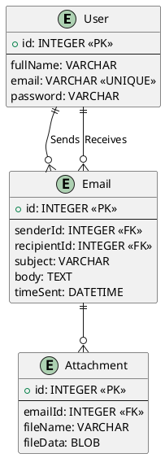

# 61FIT3WPR – Web Programming (Fall 2023)

In this assignment, you will develop a simple web-based Email System with limited features using Node.js. This is a database-driven Node application which uses EJS template engine for server-side rendering and just one API endpoint in the backend (for the delete email feature which will be described in [Section C](#c-detailed-requirements)).

## A. Summarized Requirements

- Database setup script
- Sign-in page (which is also the home page)
- Email account sign-up page
- Inbox page (show received emails, successful sign-in redirects here)
- Single email detail page (lets user reads an email)
- Outbox page (show sent emails)
- Compose page (let user create and send an email to one receiver)
  - (Optional) let user attach a single file per email.
- Sign-out feature

## B. Specific Requirements & Restrictions

- The application must operate on <http://localhost:8000/>
- The application must be developed with only the packages listed in the provided `package.json`. Students need to create a new folder for your project and run npm install to install the required packages.
- The application must use the MySQL database named `wpr2023`, with username `wpr`, password `fit2023`, on host `localhost`, port `3306`.
- You must not use any external CSS/JS library or any HTML template that is not created by yourself.

## C. Detailed Requirements

### 1. Database setup script

Write a database setup script named dbsetup.js under the project’s root folder. This script must create all required tables and initialize the following data:

- At least 3 users, one of them has the email address <a@a.com>
- At least 8 email messages between these users. <a@a.com> has received at least 2 emails from others and and sent at least 2 email to another user.

My solution:

### 2. Sign-in page (homepage)

This is the homepage of the application. Users should be able to visit this page via <http://localhost:8000/>. This page has to provide a link to the Sign-up page. This sign-in page lets user enter username and password to sign in. Suitable error messages should be showed to the user when he/she enters wrong login credentials. Upon successful sign-in, the user should be redirected to the inbox page. After signing in, user should not be asked to provide username and password again. Visiting the sign-in page again after signing in will just redirect the user to the inbox page.

(*) You can use any method possible to persist the sign-in state of the user, but the common method is to use cookies.

### 3. Sign-up page

This page is for creating a new user account. This page should ask user for his:

- Full name
- Desirable email address
- Password
- Re-enter password

This page should show suitable error messages when:

- Any field is left empty
- The email address is already used
- The password is too short (less than 6 characters)
- Re-enter password does not match password

Upon signing up, the website should show a welcome message and a link to the sign-in page.

### 4. Inbox page

The Compose, Inbox, Outbox, and Detail pages share the same layout where there is a header section which always shows the user’s full name and a “Sign out” link that lets the user sign out of the account. There should also be a vertical menu on the left where users can navigate between the Compose, Inbox, and Outbox pages.

These pages are only available for signed-in users. If anyone accesses these pages without signing in, show a suitable “access denied” page with a 403 HTTP status.

This Inbox page should show a list of received emails. This list should show the sender’s full name, the email subject, and the time received. Clicking on an email subject will open the Email detail page for that email message.

This Inbox page should be paginated. It means that you don’t show all emails in one page but should show 5 emails per page instead. You should provide the user with links to different pages of the inbox.

#### Advanced requirement

Show checkboxes next to the emails like in the above picture of the Gmail inbox. Add a Delete button in this Inbox page which allows the user to delete the selected emails. This deletion should not reload the web page so you should create an API to delete emails and use fetch in client’s JavaScript to send requests to that API. The deleted emails should be removed from this page using client JS.

Do this for both the Inbox and the Outbox page. Note that deleted emails only disappear for the user who deletes them, but will stay in the inbox and outbox of the other users (who send or receive those emails).

### 5. Compose page

This page should show a form which contains the following components:

- A drop-down box for selecting the recipient. This drop-down box shows all other users of the system. This is a bad idea in practice, but it is only for learning purposes.
- A text field for entering the email subject. Email subject is optional. You should display the subject as (no subject) for emails without a subject like Gmail does.
- A text area for entering the email’s body. Email body is also optional and should be displayed as-is in the Detail page.
- A file input for attaching a file with the email. Attaching a file is optional.
- A Send button for sending the email.

Show a suitable error message when a recipient is not selected. Also show a suitable message when the email is sent successfully.

### 6. Outbox page

This page should have a similar UI as the Inbox page (in fact, these two pages should use the same style). It lists the emails that have been sent by the signed-in user. Instead of showing the sender’s full name, this page shows the recipient’s full name instead. This page should also use pagination like in the Inbox page.

### 7. Email detail page

This page is opened when a user clicks on the subject of an email in either the Inbox or the Outbox page. This page shows the email’s subject, body text, and a link to download the attached file (if available).

## D. Submission

- Submit a single zip file named in the format: `<full_name>_<student_id>.zip`. The maximum size for your zip file is 1 MB.
- This zip file contains a single folder which is your project’s root folder. You should use the format `wpr<student_id>` to name your project folder.
- DO NOT submit `node_modules` folder but DO submit the `package.json` file and `package-lock.json` file of your project.
- Plagiarism is forbidden and your mark may be reduced up to 100% for plagiarism.
